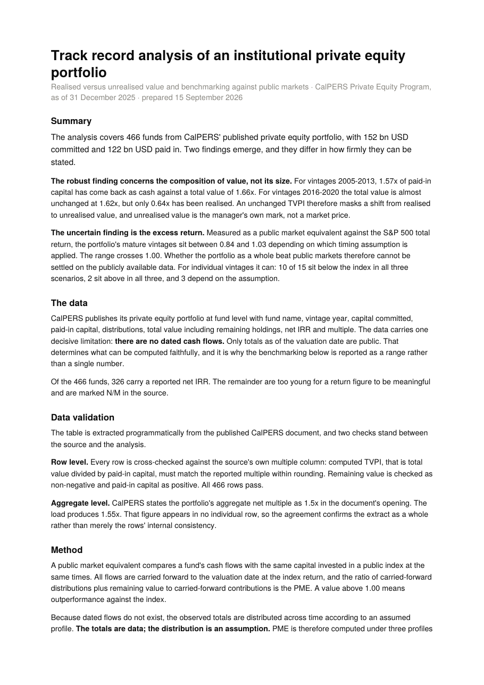
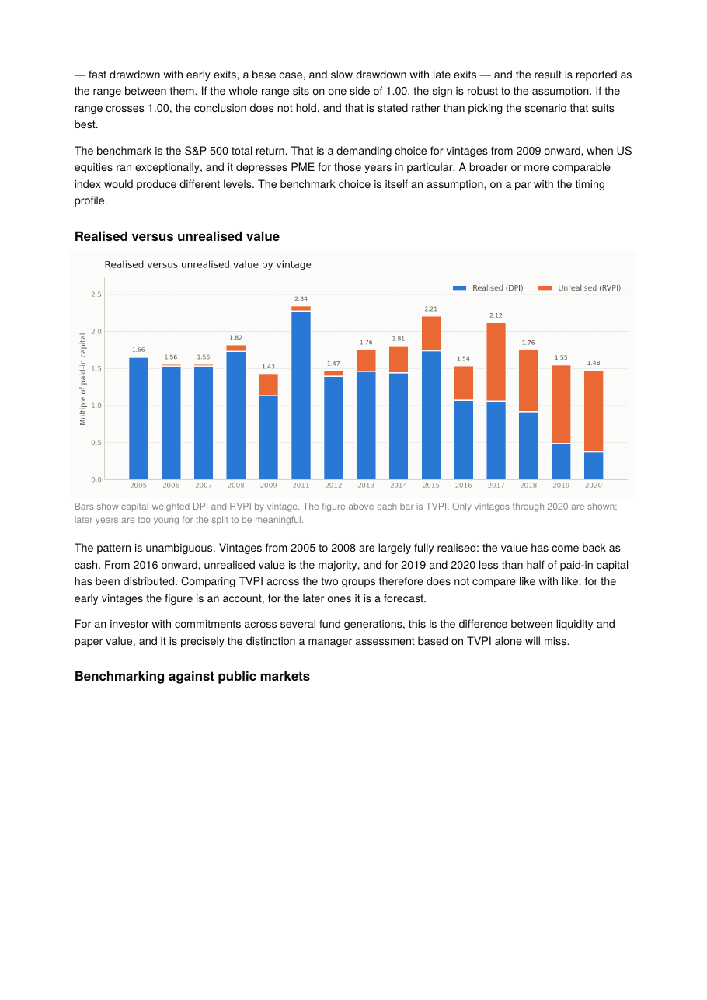
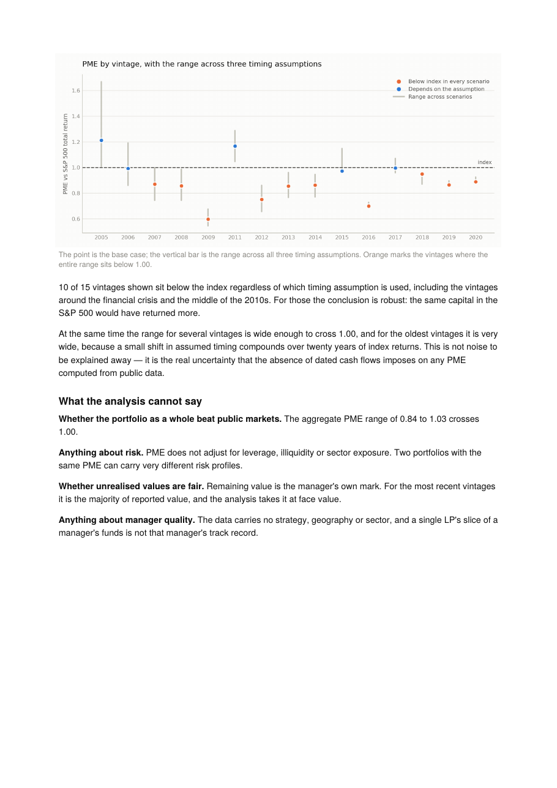
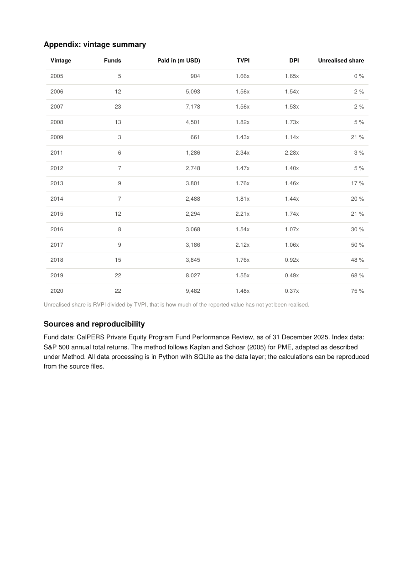

# PE Track Record Screening

Track record analysis of an institutional private equity portfolio, built on
publicly available data. Python + SQLite + matplotlib + reportlab.

**📄 [Read the full investment memo (PDF)](output/investment_memo.pdf)**

## The report

The investment memo produced by the pipeline is attached below (4 pages).
Click any page to open the full PDF.

<p align="center">
  <a href="output/investment_memo.pdf"></a>
  <a href="output/investment_memo.pdf"></a>
</p>
<p align="center">
  <a href="output/investment_memo.pdf"></a>
  <a href="output/investment_memo.pdf"></a>
</p>

## What it does

Extracts CalPERS' published private equity portfolio at fund level directly from
the source document, validates it against the source's own figures, computes
return metrics, benchmarks against public markets under explicit assumptions,
and generates an investment memo as a PDF.

The dataset is 466 funds, 152 bn USD committed and 122 bn USD paid in, as of
31 December 2025.

## What the analysis finds

**The composition of value has shifted.** For vintages 2005-2013, 1.57x of
paid-in capital has come back as cash against a total value of 1.66x, those
funds are essentially closed books. For vintages 2016-2020 the total value is
almost unchanged at 1.62x, but only 0.64x has been realised. An unchanged TVPI
masks a move from realised to unrealised value, and unrealised value is the
general partner's own mark rather than a market price.

**The excess return cannot be settled on public data.** The portfolio's mature
vintages sit at a PME between 0.84 and 1.03 depending on the timing assumption.
The range crosses 1.00. Individual vintages are sharper: 10 of 15 sit below the
index under every assumption.

## The methodological core

A Kaplan-Schoar PME requires dated cash flows. Those are not public, CalPERS
publishes only totals as of the valuation date. The project distributes the
observed totals across time under an assumed profile and computes PME under
three different profiles.

The consequence is faced rather than hidden: **the result is reported as a
range, not a single number.** If the whole range sits on one side of 1.00, the
sign is robust. If it crosses, the memo states that the conclusion does not
hold. That is the point of the project, showing precisely what the data can
and cannot support.

## Validation

Two checks stand between the source and the analysis.

**Row level.** Every row is reconciled against the source's own multiple column:
computed TVPI must match the reported multiple within rounding. Remaining value
is checked as non-negative and paid-in capital as positive. All 466 rows pass.

**Aggregate level.** CalPERS states the portfolio's aggregate net multiple as
1.5x in the document's opening. The load produces 1.55x. That figure appears in
no individual row, so the agreement confirms the extract as a whole.

**Code.** `test_pme.py` includes the identity test: a fund whose cash flows
exactly track the index must return a PME of 1.00. If that fails, the
carry-forward is wrong and every other figure is worthless.

## Running it

```bash
python3 src/extract_pdf.py <path to CalPERS PDF>   # extract the table from source
python3 src/load.py                                # load, validate, build SQLite
python3 src/vintage.py                             # vintage aggregates and dispersion
python3 src/pme.py                                 # PME with sensitivity analysis
python3 src/memo.py                                # generate investment_memo.pdf
cd src && python3 -m unittest test_pme -v          # checks
```

## Layout

```
data/calpers_pep_raw.csv      source data, generated by extract_pdf.py
data/sp500_total_return.csv   index data, annual total returns
data/pe.db                    SQLite, generated by load.py
src/extract_pdf.py            table extraction from the CalPERS PDF
src/load.py                   loading and validation
src/vintage.py                vintage aggregation and dispersion
src/pme.py                    PME under timing assumptions
src/charts.py                 figures
src/memo.py                   PDF generation
src/test_pme.py               checks
output/investment_memo.pdf    the result
docs/memo_page-*.png          page previews of the memo, embedded in this README
```

## Caveats

The benchmark is the S&P 500 total return, a demanding choice for vintages from
2009 onward when US equities ran exceptionally. A broader index would produce
different levels. The benchmark choice is itself an assumption, on a par with
the timing profile.

Remaining value is the manager's own mark and is taken at face value. For the
most recent vintages it is the majority of reported value.

The disclosure carries no strategy, geography or sector. One limited partner's
slice of a manager's funds is not that manager's track record.

## Sources

- CalPERS Private Equity Program Fund Performance Review, as of 31 December 2025
- S&P 500 annual total returns
- Kaplan, S. and Schoar, A. (2005), *Private Equity Performance: Returns,
  Persistence, and Capital Flows*, Journal of Finance
